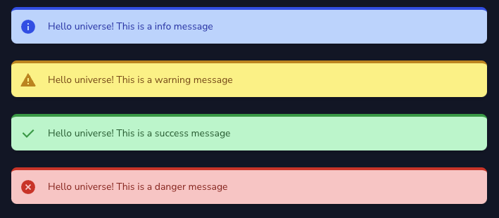
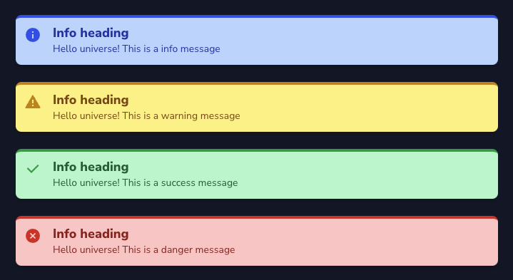

# Nova Info Card
This Project is a fork which is compatible with Nova 4. Also, this package provides an easy-and-simple way to add notification cards to a Laravel Nova Resource.

## Installation

```shell
composer require crusherrl/nova-info-card
```

## Usage

```php
use CrusherRL\NovaCards\Info;

//...

public function cards()
{
    return [
        (new Info())
            ->info('Some info message')
    ];
}
```

### Themes

This package comes with 4 predefined styles - _info_, _success_, _warning_ and _danger_. To select a theme, just use the it as the method name.

If you need to generate a card theme dynamically, you can use the `message()` method which accepts two arguments - `$message` and `$level`.

```php
->info($message)
->success($message)
->warning($message)
->danger($message)
->message($message, $level) // accepted values for $level: 'info', 'success' , 'warning', 'danger'
```



---

### Defining a header

You can also define a heading for the message using the `heading()` method:

```php
(new Info())
    ->heading('Info heading')
    ->info('Some info message')
```



---

### Render Html

If you want to render your message as raw html the same way that Nova lets you in resource fields, just chain the `asHtml()` method:

```php
(new Info())
    ->info('Be sure to checkout the original Project 
    <a href="https://github.com/pdmfc/nova-info-card/" class="underline font-bold text-blue-800">pdmfc/nova-info-card</a>!')
    ->asHtml(),
```


---

### Customizing with colors
Currently, the newest feature is to colorize specific or all parts of the card html.

Example to colorize the whole component:

```php
(new Info())
    ->info('Be sure to checkout the original Project <a href="https://github.com/pdmfc/nova-info-card/" class="underline font-bold text-blue-800">pdmfc/nova-info-card</a>!')
    ->setColors([
        'border' => 'rgb(48 107 203)',
        'background' => 'hsl(217.09deg 88.71% 75.69%)',
        'text' => '#4f4f4f',
        'icon' => 'black'
    ])
    ->asHtml(),
```


Also, you can set only specific parts, like only icon or only border.

```php
(new Info())
    ->info('Be sure to checkout the original Project<a href="https://github.com/pdmfc/nova-info-card/" class="underline font-bold text-blue-800">pdmfc/nova-info-card</a>!')
    ->setBorderColor('rgb(48 107 203)')
    ->setBackgroundColor('blue-200')
    ->setTextColor('#4f4f4f')
    ->setIconColor('black')
    ->asHtml(),
```

As you may have seen, there is a color called 'blue-200'. That's because is a predefined color which you can see here:
```json
{
  "blue-200": "rgb(191 219 254)",
  "green-200": "rgb(187 247 208)",
  "yellow-200": "rgb(254 240 138)",
  "red-200": "rgb(254 202 202)",
  "blue-600": "rgb(37 99 235)",
  "green-600": "rgb(22 163 74)",
  "yellow-600": "rgb(202 138 4)",
  "red-600": "rgb(220 38 38)"
}
```

---

## How to contribute

- clone the repo
- on `composer.json` of a laravel nova application add the following:

```
{
    //...

    "require" {
        "crusherrl/nova-info-card: "*"
    },

    //...
    "repositories": [
        {
            "type": "path",
            "url": "../path_to_your_package_folder"
        }
    ],
}
```

- run `composer update crusherrl/nova-info-card`

You're now ready to start contributing!
